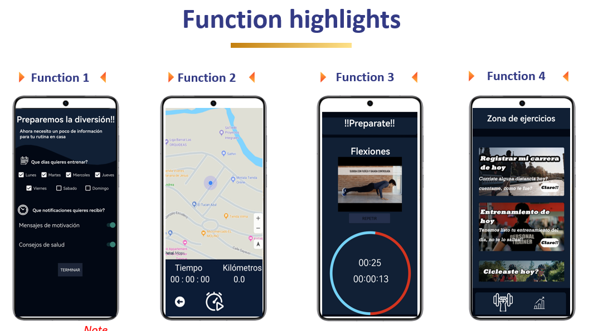
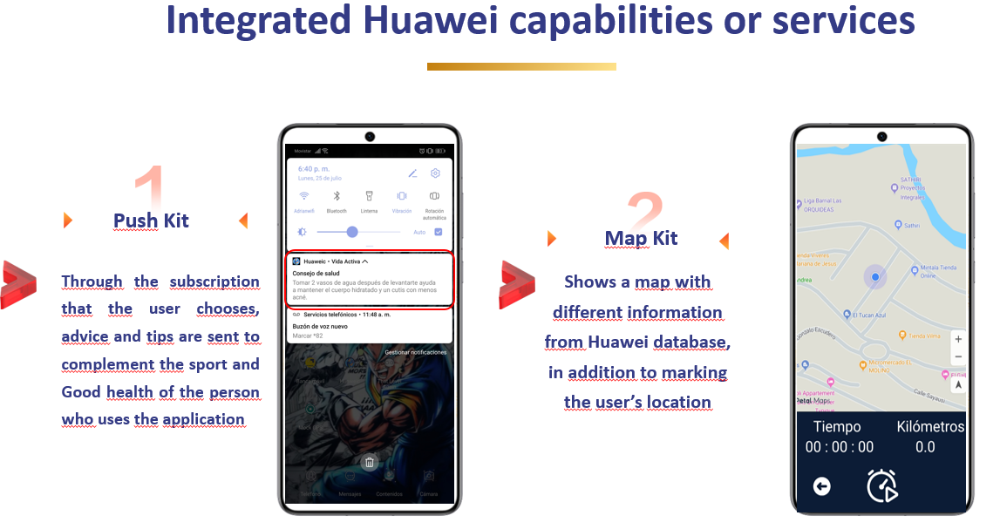
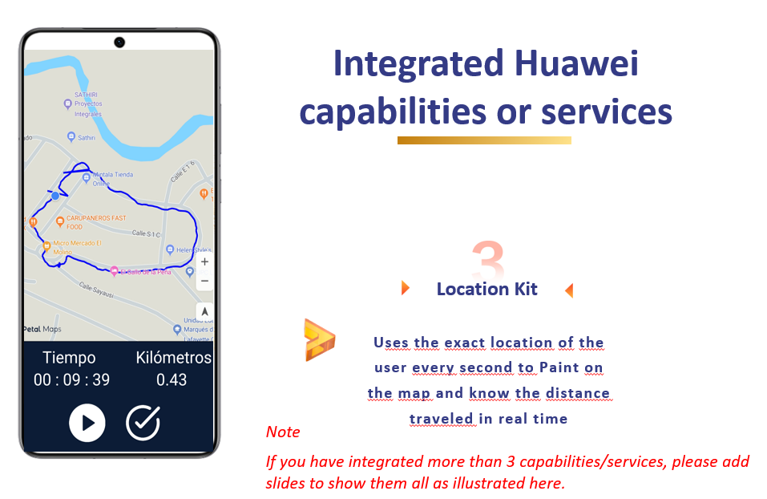
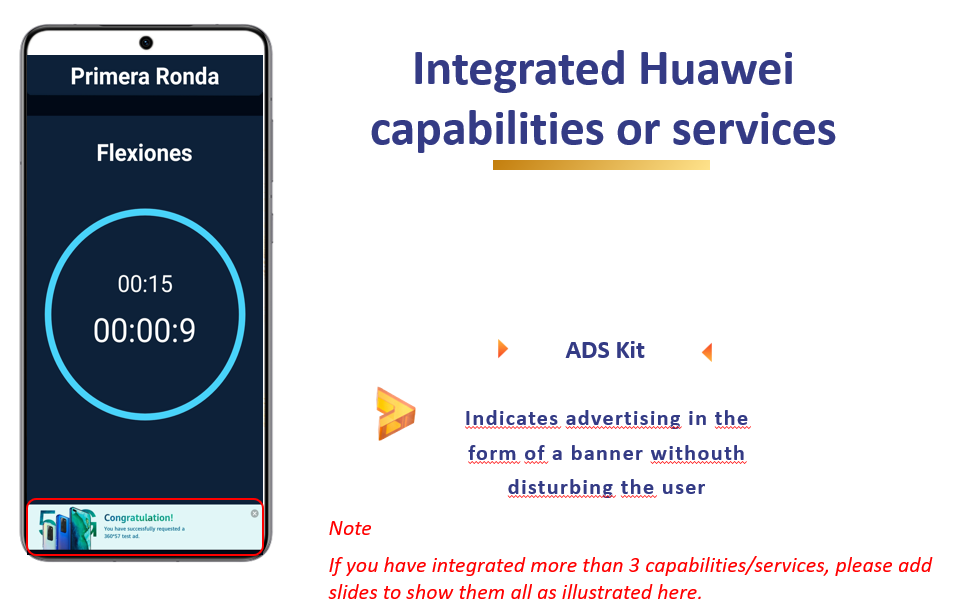

# Vida Activa

In this repository you will find the code of the Active Life App, made for the Geeck Challenge contest.

## Huawei Kits

## Built With

- Java
- HMS

## Getting Started

**In this repository I am going to create an exercise application for Geeck Challenge**

## Run it 🔨

Use the following steps to run this App locally:
- install Android Studio

- open the terminal

- get in the directory you want this folder to appear

- put: git clone `git@github.com:Adrian-Bastidas/Vida-Activa.git`

- open the proyect with Android Studio

- Open your favorite Android Emulator

- Run "Vida Activa" with Android Studio IDE

### Deployment 👀

For a live demo:

- In case you don't have an android phone, install the HMS (Huawey Mobile Services) apk:
https://consumer.huawei.com/en/community/details/Download-The-Latest-Version-Of-Huawei-HMS-Core-Apk/topicId_96149/

- Install the application in yout phone:
https://mega.nz/file/AtNTmDJI#kQhNoDcKftfpUsGO5kLMAQkYkgjNJ2NwypdNb0gbi9g

## Author

👤 **Adrian Rafael Bastidas Moya**

- GitHub: [@Adrian-Bastidas](https://github.com/Adrian-Bastidas)
- Facebook: [Adrian Bastidas](https://www.facebook.com/rafdrian/)
- LinkedIn: [Adrian Rafael Bastidas Moya](https://www.linkedin.com/in/adrian-rafael-bastidas-moya-5b940419b/)
